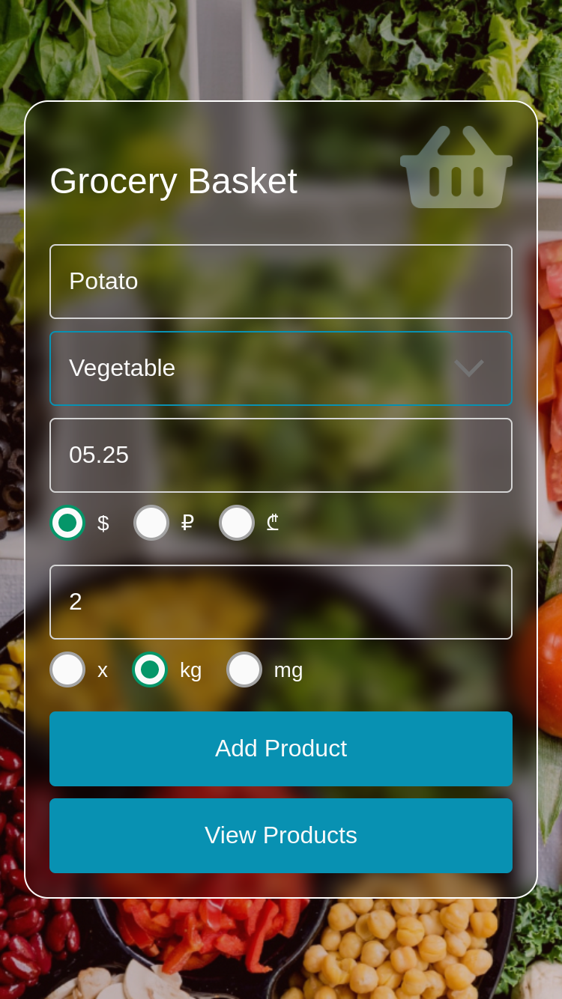

**Project Description**

This project is a mobile application built with React Native. It simplifies the process of buying products.

**Technologies**

- React
- React Native
- Native Base
- Expo

**Screenshots**

Here are some screenshots of the app:

**Installation**

To install the app, follow these steps:

1. Clone the repository.
2. Install dependencies: `npm install`
3. Run the app on the web: `npm run web`
